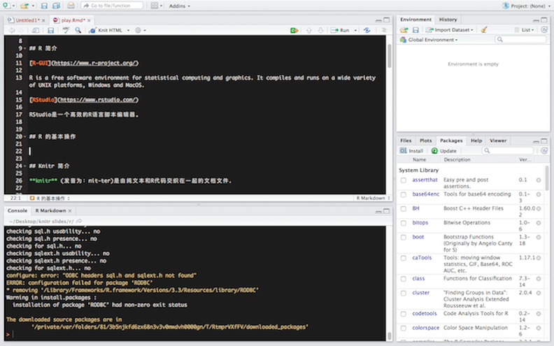

## R 简介 

[R-GUI](https://www.r-project.org/)   

R is a free software environment for statistical computing and graphics. It compiles and runs on a wide variety of UNIX platforms, Windows and MacOS.

[RStudio](https://www.rstudio.com/)   

RStudio是一个高效的R语言脚本编辑器。   


## R 的基本操作




## R 的数据连接

```{r tidy=TRUE, highlight=TRUE}
library(RMySQL)
con = dbConnect(MySQL(),user="work", password="123456", dbname="data_bi", host="192.168.225.208")
myQuery <- "select * from app_fact_auth_pv_statistics;"
mydt <- dbGetQuery(con, myQuery)

head(mydt)
```


## Knitr 简介 

**knitr** (发音为：nit-ter)是由纯文本和R代码交织在一起的文档文件.  
  
  
Knitr和RStudio集成是快速生成报告的最佳组合。简单地说，报告中有文字也有代码，Knitr就是通过markdown的语法在报告中该显示代码的地方显示代码，该显示运行结果（比如图表）的地方显示运行结果，这样整个报告文档就可以直接运行再次生成报告，而不需要把代码单独复制到控制台中执行，然后再把执行结果添加到文档中。  
  
  
此包是由R大神谢益辉制作。谢益辉毕业于爱荷华大学统计学博士专业，现就职与Rstudio。  
  
  
[Knitr包的作者说明网站](http://yihui.name/knitr/)


## 操作流程

>- 打开-用RMARKDOWN打开一个新的文件
>- 撰写-用RMARKDOWN语法书写内容
>- 嵌入-在内容当中嵌入R代码
>- 生成-将R代码生成结果，输出报告(PDF,Word,Html,Slides)

## 新建Rmarkdown文件

>- 在menu选项上，点击**File-New File-R Markdown..**
>- 在新开启的窗口中选择输出文件的类型
>- 点击OK


## 使用Markdown语法

>- 直接在编辑器里书写报告内容
>- 用Markdown语法完善报告的格式
>- [Markdown语法cheetsheet](https://github.com/adam-p/markdown-here/wiki/Markdown-Cheatsheet)

## 选择输出类型

>- **YAML**是每个RMD文件的表头代码, 它决定了RMD会输出何种文件形式

```
---
title: "Rstudio Knitr 包分享"
author: "Qi Zou"
date: "August 16, 2016"
output: ioslides_presentation
---
```
>- output: html_document---html file (web page)  
>- output: pdf_document---pdf document  
>- output: word_document---Microsoft Word.docx  
>- output: beamer_presentation---beamer slideshow (pdf)  
>- output: ioslides_presentation---ioslides slideshow (html)  

## 嵌入R代码
>- 用Knitr的语法将R代码嵌入报告
>- Rstudio会在你生成报告的同时计算出R代码的结果

## R代码的类型
>- inline code

 Two plus two equals `r 2 + 2`

>- code chunks  

```{r tidy=TRUE, highlight=TRUE}
library(RMySQL)
con = dbConnect(MySQL(),user="work", password="123456", dbname="data_bi", host="192.168.225.208")
myQuery <- "select * from app_fact_auth_pv_statistics;"
mydt <- dbGetQuery(con, myQuery)

```


## 报告生成
报告有两种生成方式  

>- 使用代码 rmarkdown::render("<file path>")
>- 在Rstudio面板上点击**knit HTML**键

当你生成报告时，R会  

>- 执行每一条嵌入的R代码并将其插入你的报告当中
>- 依据选择类型自动建立一个新的报告文件
>- 自动在可视化面板当中生成预览
>- 在选择的工作路径当中自动存储生成的报告


## 交互型文档

HTML 插件是以浏览器为依托的可交互控件，可使用的HTML插件库如下

>- leaflet: 交互式地图
>- dygraphs: 时间序列交互图
>- Ploty: ggplot交互版
>- networkD3: 网络图
>- DT: 交互式表格
>- threejs: 3D交互图

## leaflet 交互式地图
<iframe width="1000" height="500" frameborder="0" scrolling="no" src="./graphs/leaflet1.html"></iframe>

## dygraphs 时间序列交互图
<iframe width="1000" height="500" frameborder="0" scrolling="no" src="./graphs/dygraphs3.html"></iframe>

## Ploty ggplot2 交互版
<iframe width="1000" height="500" frameborder="0" scrolling="no" src="./graphs/plotly.html"></iframe>

## networkD3 网络图
<iframe width="1000" height="500" frameborder="0" scrolling="no" src="./graphs/network.html"></iframe>

## DT 交互式表格
<iframe width="1000" height="500" frameborder="0" scrolling="yes" src="./graphs/dt1.html"></iframe>

## threejs 3D交互图
<iframe width="1000" height="500" frameborder="0" scrolling="no" src="./graphs/threejs2.html"></iframe>

# Thanks!!
## [Back to Qi's homepage](https://zouqi1987.github.io/Site-building/)
