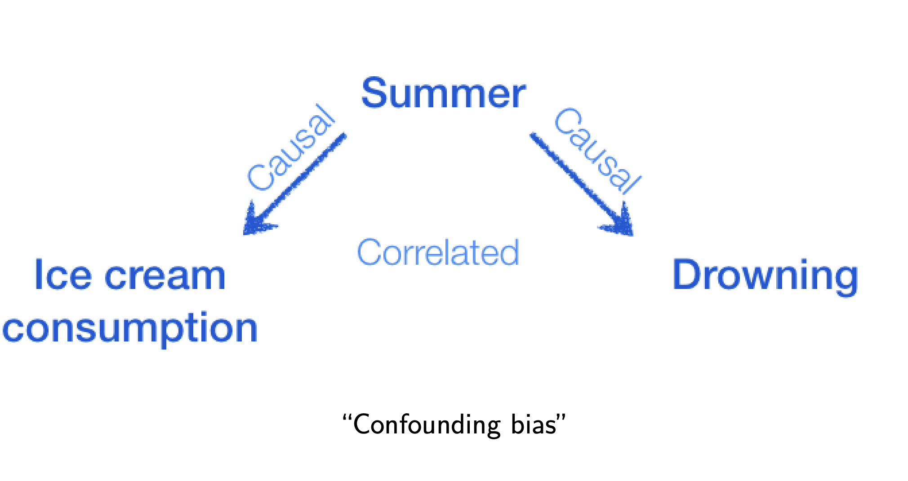
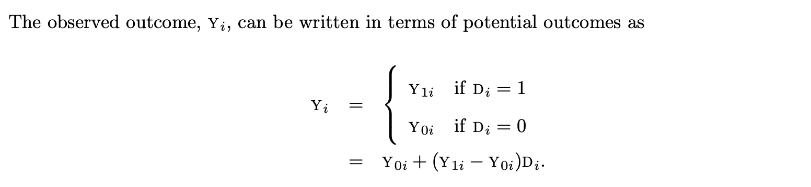
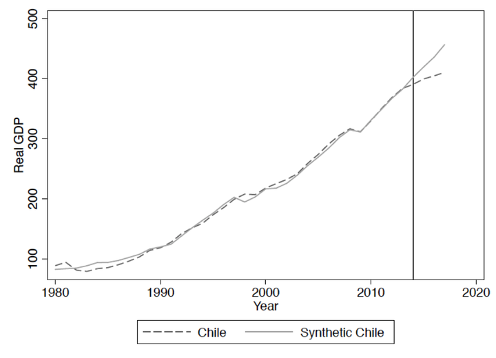

## Credit

> - 本次分享借鉴了大量 DA wiki的内容
> - 经济学家团队在中学有系列教程

# 什么是因果推断

## 因果vs相关
> - 因果推断(causal inference)能够解释某个因素(treatment)如何导致观测对象（例如用户）的结果（outcome) 发生变化。
> - 相关性分析(correlation analysis)则体现一个因素的变化和观测对象的结果变化的相关性。

# 冰激凌与死亡率
##  {data-background="./ice.gif"}

## 吃的越多死的越快

```{r fig.align = 'center', echo=FALSE, message=FALSE, warning=FALSE}
library(ggplot2)
library(hrbrthemes)
x <- runif(100, 20, 100)
z <- rnorm(100, 0, 10)
y <- 3*x + 10 + z
df <- cbind.data.frame(x, y)

ggplot(df, aes(x=x, y=y/1000)) + 
  geom_point() + 
  geom_smooth(method = "lm") + 
  ylab("死亡率") + 
  xlab("冰淇淋消费") +
  theme_ipsum(base_family = "STHeiti") +
  theme(axis.ticks = element_blank(), axis.text = element_blank())
```

## 吃冰激凌真的会死么？

<center>

</center>

## 为什么更关心因果

业务场景

> - 昨天: vivo 内容输出项目去年就上线了，我们如何评估这个项目对主站收益影响

> - 今天: 一个实验渗透率极低，且渗透样本有偏，不符合正太分布，如何评价效果

> - 明天: 我们推荐算法对社交生态会产生怎样的影响

这些问题当中我们不仅关心事件的<span style="color:orange;" >相关性</span>, 更重要的是<span style="color:red;" >因果性</span>


# 医院与健康

## 不去医院更健康

过去12个月内你是否住过院？

<small>1-5；1:excellent, 5:poor</small>

| 分组       | 样本量 | 平均健康状态 | Std. Error |
| ----------- | ----------- | ------------------ | ---------- |
| 住过院    | 7774        | 2.79               | 0.014      |
| 没住过院 | 90049       | 2.07               | 0.003      |


结果说明去过医院会使你的健康状态下滑


## 问题描述

医院治疗: $D_i=\{0,1\}$ <br/>
$i$ 的健康状况: $Y_i$ <br/>
问题：$D_i \rightarrow Y_i$ 之前的医院治疗是否会影响到现在的健康状况

<center>

</center>

$Y_{1i}-Y_{0i}$ 就是我们想要知道的因果关系

<span style="color:red;" >但是，在我们这个宇宙，$Y_{1i}$ 和 $Y_{0i}$ 无法被同时观测到</span>


## 天真算法

我们无法观测某个人的两种treatment的反馈，但我们可以观测一群人的

<center>

</center>

<small>$E[Y_{1i}|D_i=1]-E[Y_{0i}|D_i=1]$ : 住院的人的健康水平与这波人<span style="color:red;">假如没有住院的话</span>的健康水平的差异</small>

<small>$E[Y_{0i}|D_i=1]-E[Y_{0i}|D_i=0]$ : 住院的人<span style="color:red;">假如没有住院的话</span>的健康水平与没有住院的人的健康水平的差异</small>


## 随机分配 

假如分组是随机的

> - 使得实验组的人和控制组的人在没有实验的情况下平均反馈都是一样的$$E[Y_{0i}|D_i=1]=E[Y_{0i}|D_i=0]$$

> - selection bias <span style="color:red;">消失了</span>


## <span style="color:black; font-size:88px">NICE!!!</span> {data-background="./nice.gif"}


## 随机的局限

虽然随机分配实验可以消除选择性差异，但他并不是万能的

> - 我们无法随机分配住院的人，从而形成无偏的实验组和对照组，没病的人不会去住院

> - 吸烟对肺癌的影响，我们无法随机选取对象让他们吸烟

# 因果推断的方法

## 常用方法

> - 随机试验(A/B testing)
> - 双重差分(difference-in-difference)
> - 匹配(matching)
> - <span style="color:red;">合成控制(synthetic control)</span>
> - 矩阵补全(matrix completion)
> - 基于决策树和随机森林的heterogeneous treatment effect (HTE)

## 合成控制

synthetic control 是一种估计因果效用的方法，一般是通过加权平均多个 control 组来拟合一条和 target 组在treatment（政策）实施之前非常相近的曲线，如下图所示，虚线是多个 control 组的加权平均而得到的曲线，从而我们认为如果没有 treatment 的介入，target组的趋势应该会按照虚线进行下去。

## Synthetic Control

<center>

</center>

# Synthetic Control 实现

## CausalImpact in R by Google

Given a response time series (e.g., clicks) and a set of control time series (e.g., clicks in non-affected markets or clicks on other sites), the package constructs a [Bayesian structural time-series model](https://research.google/pubs/pub41854/). This model is then used to try and predict the counterfactual, i.e., how the response metric would have evolved after the intervention if the intervention had never occurred. 


## Kwai 应用

内容输出与主站贡献


<style type="text/css">
  .reveal p {
    text-align: left;
  }
  .reveal ul {
    display: block;
  }
  .reveal ol {
    display: block;
  }
</style>