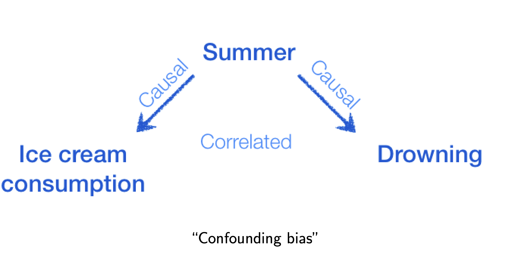
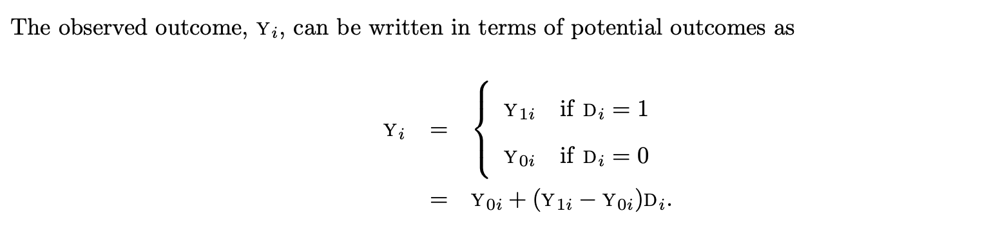
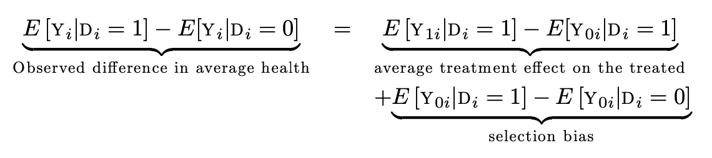

# 什么是因果推断

## 因果vs相关
> - 因果推断(causal inference)能够解释某个因素(treatment)如何导致观测对象（例如用户）的结果（outcome) 发生变化。
> - 相关性分析(correlation analysis)则体现一个因素的变化和观测对象的结果变化的相关性。

# 冰激凌与死亡率
##  {data-background="./ice.gif"}

## 吃的越多死的越快

## 吃冰激凌真的会死么？

## 为什么更关心因果

业务场景

> - 昨天: vivo 内容输出项目去年就上线了，我们如何评估这个项目对主站收益影响

> - 今天: 一个实验渗透率极低，且渗透样本有偏，不符合正太分布，如何评价效果

> - 明天: 我们推荐算法对快手的社交生态会产生怎样的影响

- 这些问题当中我们不仅关心事件的相关性，更重要的是因果性

# 医院与健康

## 没有医院更健康

<small>1 to excellent health and a 5 to poor health</small>

| Group       | Sample Size | Mean health status | Std. Error |
| ----------- | ----------- | ------------------ | ---------- |
| Hospital    | 7774        | 2.79               | 0.014      |
| No Hospital | 90049       | 2.07               | 0.003      |

> The difference in the means is 0.71, a large and highly significant contrast in favor of the non-hospitalized, with a t-statistic of 58.9.

## Math Behind

